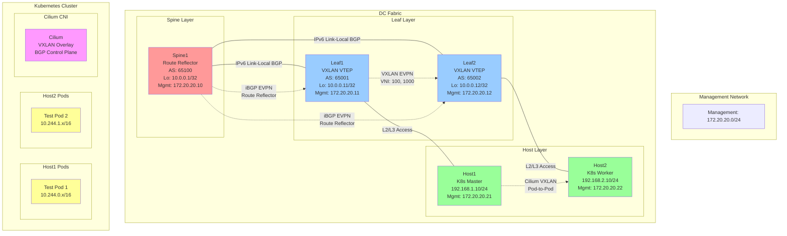

# DC Fabric with VXLAN EVPN and Cilium CNI Lab

[](https://github.com/gko01/dc-fabric-cilium-lab)
[](https://containerlab.dev/)
[](https://www.nokia.com/networks/products/service-router-linux-NOS/)
[](https://kubernetes.io/)
[](https://cilium.io/)
[](https://opensource.org/licenses/MIT)

This lab demonstrates a datacenter fabric using BGP as underlay routing protocol with VXLAN EVPN overlay, integrated with a Kubernetes cluster running Cilium CNI.

## 🚀 Quick Start

```bash
# Clone the repository
git clone https://github.com/gko01/dc-fabric-cilium-lab.git
cd dc-fabric-cilium-lab

# Deploy everything in one command
make all

# Or step by step
make deploy && make setup && make test
```

## 📚 Documentation

- 📖 [Quick Start Guide](QUICKSTART.md) - Get up and running in 5 minutes
- 🏗️ [Architecture Details](#architecture-overview) - Understanding the design
- 🔧 [Configuration Guide](#deployment-steps) - Step-by-step setup
- 🧪 [Testing Guide](#testing-and-validation) - Validation procedures
- 🤝 [Contributing](CONTRIBUTING.md) - How to contribute

## Architecture Overview



## Network Design

### Underlay Network (BGP IPv6 Link-Local)
- **Spine1**: Route Reflector for BGP EVPN (AS 65100)
- **Leaf1**: VXLAN VTEP (AS 65001)
- **Leaf2**: VXLAN VTEP (AS 65002)
- **BGP**: IPv6 link-local addresses for underlay reachability
- **Loopbacks**: 10.0.0.0/24 range for VTEP addressing

### Overlay Network (VXLAN EVPN)
- **L2 VNI**: 100 (Layer 2 VXLAN Network Identifier)
- **L3 VNI**: 1000 (Layer 3 VXLAN Network Identifier)
- **Route Targets**: target:65001:100 and target:65001:1000
- **EVPN**: BGP EVPN for MAC/IP route advertisement

### Kubernetes Network
- **Pod CIDR**: 10.244.0.0/16
- **Service CIDR**: 10.96.0.0/12
- **CNI**: Cilium with VXLAN tunnel mode
- **BGP Control Plane**: Cilium BGP for service advertisement

## Prerequisites

1. **Containerlab**: Install containerlab (https://containerlab.dev/install/)
2. **Nokia SR Linux Image**: Nokia SR Linux container image (ghcr.io/nokia/srlinux:23.10.1)
3. **Docker**: Docker installed and running
4. **Linux Environment**: Linux host with sufficient resources

### Installing Containerlab (Ubuntu/Debian)
```bash
bash -c "$(curl -sL https://get.containerlab.dev)"
```

### Nokia SR Linux Image
The Nokia SR Linux container image is publicly available and will be automatically pulled:
```bash
docker pull ghcr.io/nokia/srlinux:23.10.1
```

## Directory Structure

```
cilium-integration/
├── dc-fabric.yml                  # Main containerlab topology
├── README.md                      # This file
├── configs/                       # Device configurations
│   ├── spine/
│   │   └── spine1.cfg            # Spine switch configuration
│   ├── leaf/
│   │   ├── leaf1.cfg             # Leaf1 switch configuration
│   │   └── leaf2.cfg             # Leaf2 switch configuration
│   └── hosts/
│       ├── host1.sh              # Host1 setup script
│       └── host2.sh              # Host2 setup script
├── k8s/                           # Kubernetes configurations
│   ├── init-cluster.sh           # K8s cluster initialization
│   ├── install-cilium.sh         # Cilium CNI installation
│   ├── cilium-bgp-config.yaml    # Cilium BGP configuration
│   └── test-pods.yaml            # Test pod deployments
└── scripts/                      # Automation scripts
    ├── deploy-lab.sh              # Lab deployment script
    ├── setup-k8s.sh              # K8s setup automation
    ├── test-connectivity.sh      # Connectivity testing
    └── cleanup-lab.sh             # Lab cleanup script
```

## Deployment Steps

### 1. Deploy the Lab Environment
```bash
# Make scripts executable
chmod +x scripts/*.sh

# Deploy the containerlab topology
./scripts/deploy-lab.sh
```

### 2. Wait for Convergence
Wait for BGP sessions to establish and EVPN routes to be exchanged:
```bash
# Check BGP status on spine
docker exec clab-dc-fabric-cilium-spine1 sr_cli "show router bgp summary"

# Check EVPN routes
docker exec clab-dc-fabric-cilium-spine1 sr_cli "show router bgp routes evpn"
```

### 3. Setup Kubernetes Cluster
```bash
# Automated K8s setup (recommended)
./scripts/setup-k8s.sh

# OR manual setup:
# 3a. Initialize cluster on host1
docker exec -it clab-dc-fabric-cilium-host1 bash /tmp/k8s/init-cluster.sh

# 3b. Join host2 to cluster
JOIN_CMD=$(docker exec clab-dc-fabric-cilium-host1 cat /tmp/join-command.sh)
docker exec -it clab-dc-fabric-cilium-host2 bash -c "$JOIN_CMD"

# 3c. Install Cilium CNI
docker exec -it clab-dc-fabric-cilium-host1 bash /tmp/k8s/install-cilium.sh

# 3d. Apply Cilium BGP configuration
docker exec clab-dc-fabric-cilium-host1 kubectl apply -f /tmp/k8s/cilium-bgp-config.yaml

# 3e. Deploy test pods
docker exec clab-dc-fabric-cilium-host1 kubectl apply -f /tmp/k8s/test-pods.yaml
```

### 4. Verify Deployment
```bash
# Run comprehensive connectivity tests
./scripts/test-connectivity.sh

# Check cluster status
docker exec clab-dc-fabric-cilium-host1 kubectl get nodes -o wide
docker exec clab-dc-fabric-cilium-host1 kubectl get pods -o wide

# Check Cilium status
docker exec clab-dc-fabric-cilium-host1 cilium status
```

## Testing and Validation

### BGP Underlay Validation
```bash
# Check BGP sessions on spine (route reflector)
docker exec clab-dc-fabric-cilium-spine1 sr_cli "show network-instance default protocols bgp neighbor"

# Check received routes
docker exec clab-dc-fabric-cilium-spine1 sr_cli "show network-instance default route-table"

# Check BGP neighbors on leaf switches
docker exec clab-dc-fabric-cilium-leaf1 sr_cli "show network-instance default protocols bgp neighbor"
docker exec clab-dc-fabric-cilium-leaf2 sr_cli "show network-instance default protocols bgp neighbor"
```

### VXLAN EVPN Overlay Validation
```bash
# Check EVPN routes on spine
docker exec clab-dc-fabric-cilium-spine1 sr_cli "show network-instance default protocols bgp routes evpn"

# Check VXLAN tunnel status on leafs
docker exec clab-dc-fabric-cilium-leaf1 sr_cli "show tunnel-interface vxlan1"
docker exec clab-dc-fabric-cilium-leaf2 sr_cli "show tunnel-interface vxlan1"

# Check EVPN instance status
docker exec clab-dc-fabric-cilium-leaf1 sr_cli "show network-instance mac-vrf-100 protocols bgp-evpn"
```

### Kubernetes and Cilium Validation
```bash
# Check cluster health
docker exec clab-dc-fabric-cilium-host1 kubectl cluster-info
docker exec clab-dc-fabric-cilium-host1 kubectl get nodes -o wide

# Check Cilium agent status
docker exec clab-dc-fabric-cilium-host1 cilium status --verbose

# Check Cilium connectivity
docker exec clab-dc-fabric-cilium-host1 cilium connectivity test

# Check BGP peers in Cilium
docker exec clab-dc-fabric-cilium-host1 cilium bgp peers

# Test pod-to-pod connectivity
POD1=$(docker exec clab-dc-fabric-cilium-host1 kubectl get pods -l app=test-pod1 -o jsonpath='{.items[0].metadata.name}')
POD2_IP=$(docker exec clab-dc-fabric-cilium-host1 kubectl get pods -l app=test-pod2 -o jsonpath='{.items[0].status.podIP}')
docker exec clab-dc-fabric-cilium-host1 kubectl exec $POD1 -- ping -c 3 $POD2_IP
```

### Traffic Flow Analysis
```bash
# Monitor BGP updates
docker exec clab-dc-fabric-cilium-spine1 sr_cli "monitor network-instance default protocols bgp"

# Check VXLAN encapsulation
docker exec clab-dc-fabric-cilium-leaf1 sr_cli "show network-instance mac-vrf-100 bridge-table"

# Monitor Cilium datapath
docker exec clab-dc-fabric-cilium-host1 cilium monitor --type trace
```

## Key Configuration Details

### BGP IPv6 Link-Local Underlay
- Uses IPv6 link-local addresses for BGP peering
- Eliminates need for IP address configuration on spine-leaf links
- Provides scalable underlay connectivity

### VXLAN EVPN Overlay
- **EVI 100**: Layer 2 VNI for bridging
- **EVI 1000**: Layer 3 VNI for routing
- BGP EVPN Type 2 routes for MAC/IP advertisement
- BGP EVPN Type 3 routes for multicast handling

### Cilium CNI Integration
- **Tunnel Mode**: VXLAN encapsulation for pod-to-pod communication
- **BGP Control Plane**: Advertises pod CIDRs and service IPs
- **kube-proxy Replacement**: Partial mode for service load balancing
- **Hubble**: Network observability and monitoring

## Troubleshooting

### Common Issues

1. **BGP Sessions Not Establishing**
   ```bash
   # Check interface status
   docker exec clab-dc-fabric-cilium-spine1 sr_cli "show interface ethernet-1/1"
   
   # Verify IPv6 link-local addresses
   docker exec clab-dc-fabric-cilium-spine1 sr_cli "show interface ethernet-1/1 detail"
   ```

2. **EVPN Routes Missing**
   ```bash
   # Check BGP EVPN family
   docker exec clab-dc-fabric-cilium-spine1 sr_cli "show network-instance default protocols bgp neighbor detail"
   
   # Verify EVPN configuration
   docker exec clab-dc-fabric-cilium-leaf1 sr_cli "show network-instance mac-vrf-100 protocols bgp-evpn"
   ```

3. **Kubernetes Nodes Not Ready**
   ```bash
   # Check kubelet logs
   docker exec clab-dc-fabric-cilium-host1 journalctl -u kubelet -f
   
   # Verify container runtime
   docker exec clab-dc-fabric-cilium-host1 systemctl status docker
   ```

4. **Cilium Pods Not Running**
   ```bash
   # Check Cilium daemonset
   docker exec clab-dc-fabric-cilium-host1 kubectl get ds -n kube-system
   
   # Check Cilium logs
   docker exec clab-dc-fabric-cilium-host1 kubectl logs -n kube-system -l k8s-app=cilium
   ```

5. **Pod Connectivity Issues**
   ```bash
   # Check Cilium endpoint status
   docker exec clab-dc-fabric-cilium-host1 cilium endpoint list
   
   # Verify pod network configuration
   docker exec clab-dc-fabric-cilium-host1 kubectl get pods -o wide
   ```

### Debug Commands

```bash
# BGP debugging
docker exec clab-dc-fabric-cilium-spine1 sr_cli "show network-instance default protocols bgp neighbor detail"

# EVPN debugging
docker exec clab-dc-fabric-cilium-leaf1 sr_cli "show network-instance mac-vrf-100 protocols bgp-evpn detail"

# Interface debugging
docker exec clab-dc-fabric-cilium-spine1 sr_cli "show interface ethernet-1/1 detail"

# Cilium debugging
docker exec clab-dc-fabric-cilium-host1 cilium debuginfo

# Network troubleshooting from pods
docker exec clab-dc-fabric-cilium-host1 kubectl exec -it <pod-name> -- /bin/bash
```

## Lab Extensions

### 1. Multi-Tenant EVPN
- Add additional VRFs and EVPN instances
- Implement route target filtering
- Configure inter-tenant communication policies

### 2. Load Balancing
- Deploy MetalLB or Cilium L4LB
- Configure service advertisements via BGP
- Test external service reachability

### 3. Security Policies
- Implement Cilium Network Policies
- Configure micro-segmentation
- Test east-west traffic filtering

### 4. Monitoring and Observability
- Deploy Prometheus and Grafana
- Enable Hubble metrics collection
- Configure network flow monitoring

### 5. High Availability
- Add redundant spine switches
- Implement MLAG on leaf switches
- Configure Kubernetes control plane HA

## Cleanup

To clean up the lab environment:
```bash
./scripts/cleanup-lab.sh
```

Or manually:
```bash
containerlab destroy -t dc-fabric.yml
docker system prune -f
```

## References

- [Containerlab Documentation](https://containerlab.dev/)
- [Nokia SR OS Documentation](https://documentation.nokia.com/)
- [Cilium Documentation](https://docs.cilium.io/)
- [EVPN RFC 7432](https://tools.ietf.org/html/rfc7432)
- [BGP EVPN RFC 8365](https://tools.ietf.org/html/rfc8365)
- [Kubernetes Networking](https://kubernetes.io/docs/concepts/cluster-administration/networking/)

## Contributing

Feel free to submit issues and enhancement requests. This lab environment is designed for educational and testing purposes.

See [CONTRIBUTING.md](CONTRIBUTING.md) for detailed contribution guidelines.

## Contributors

Thanks to all contributors who have helped improve this lab! 🎉

<!-- Add contributors here -->

## License

This project is licensed under the MIT License - see the [LICENSE](LICENSE) file for details.

## Acknowledgments

- [Containerlab](https://containerlab.dev/) - Network lab automation
- [Nokia SR Linux](https://www.nokia.com/networks/products/service-router-linux-NOS/) - Network Operating System
- [Cilium](https://cilium.io/) - Cloud Native Networking and Security
- [Kubernetes](https://kubernetes.io/) - Container Orchestration

---

**Note**: This lab requires significant system resources. Ensure your host has adequate CPU, memory, and disk space before deployment.
